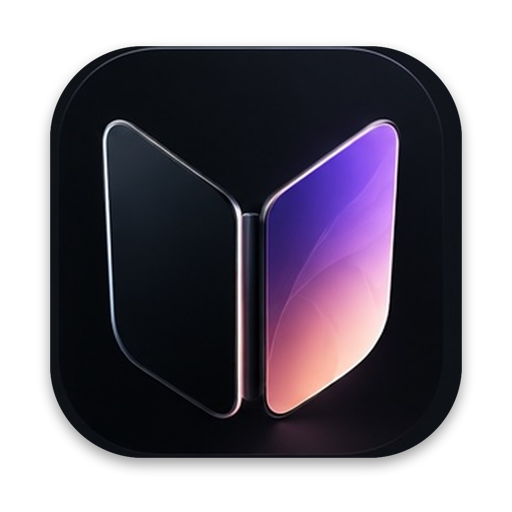
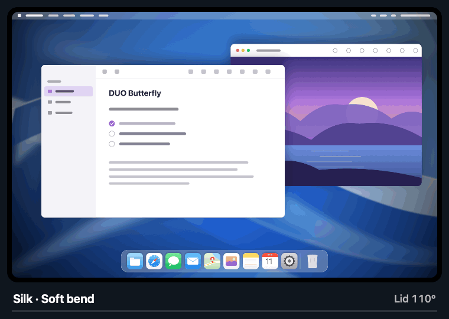
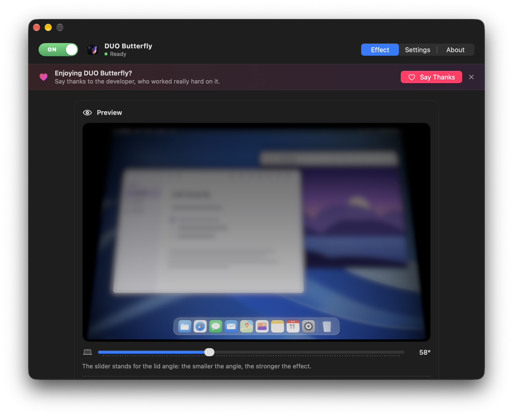
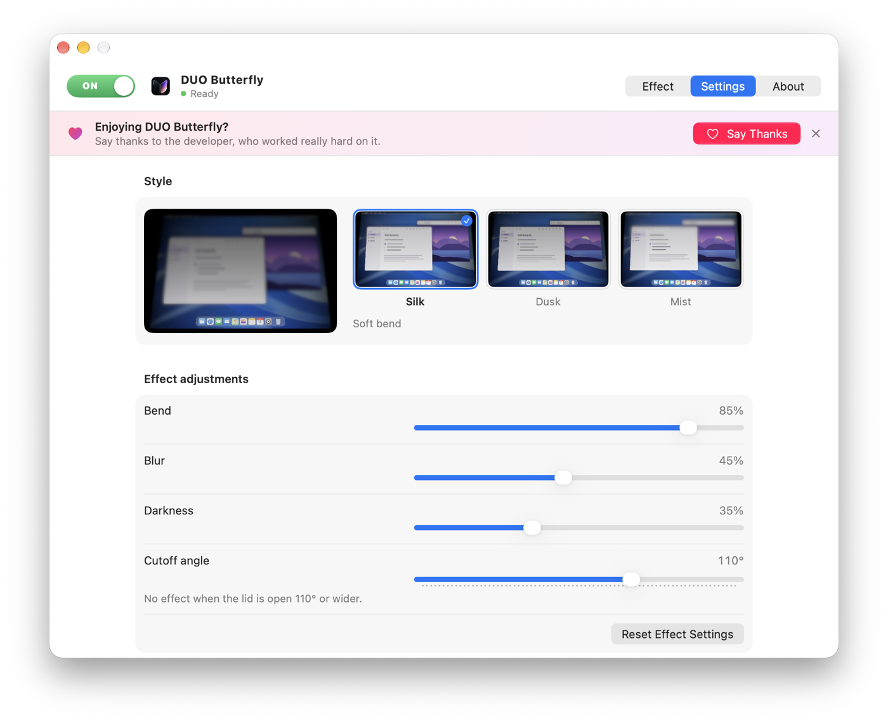
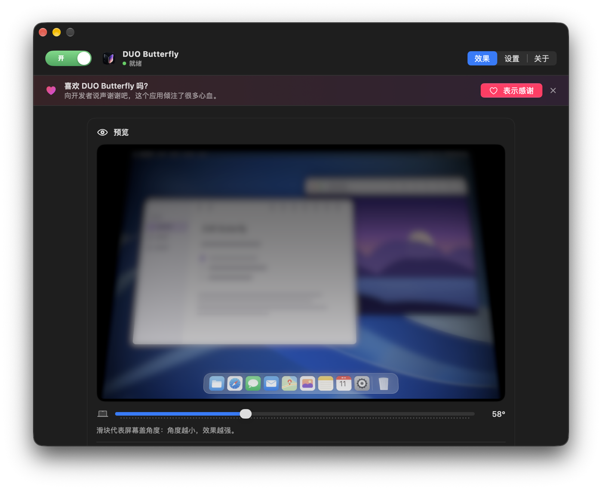
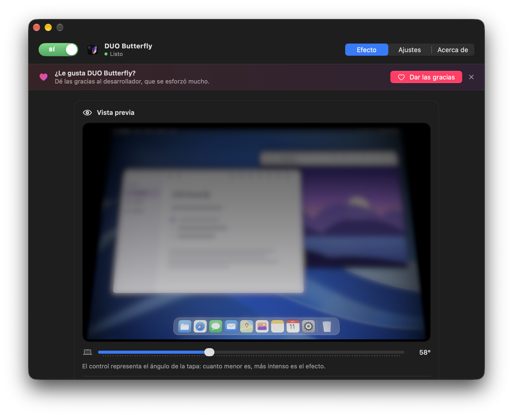
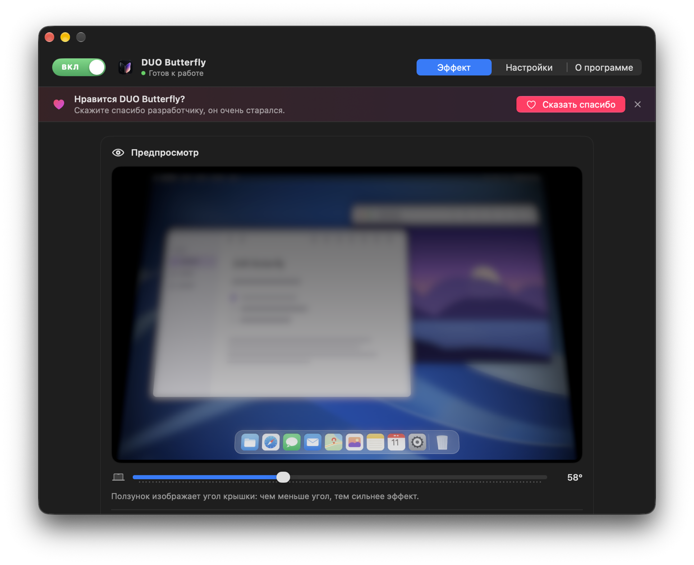

<p align="center">
  
</p>

<h1 align="center">DUO Butterfly</h1>

<p align="center">
  <b>Lower your MacBook's lid and the desktop bends, blurs, and darkens.</b>
</p>

<p align="center">
  <a href="https://github.com/galaxysochi-code/DuoButterfly/actions/workflows/ci.yml"></a>
  <a href="https://github.com/galaxysochi-code/DuoButterfly/releases/latest"></a>
  
  
  
  <a href="LICENSE"></a>
</p>

<p align="center">
  <b>English</b> · <a href="#简体中文">简体中文</a> · <a href="#español">Español</a> · <a href="#русский">Русский</a>
</p>

<p align="center">
  <a href="https://github.com/galaxysochi-code/DuoButterfly/releases/latest"><b>Download</b></a> ·
  <a href="docs/INSTALLING.md">Install</a> ·
  <a href="docs/BUILDING.md">Build</a> ·
  <a href="PRIVACY.md">Privacy</a> ·
  <a href="CHANGELOG.md">Changelog</a>
</p>

<p align="center">
  
</p>

DUO Butterfly is a menu bar utility for MacBook. As you lower the lid, the desktop image smoothly
bends, blurs, and darkens, and it comes back as you open the lid. Everything runs on your Mac:
no accounts, no analytics, no network requests.

> **🪟 A Windows version is coming soon.** Star or watch the repository to get notified.

## Features

- **Three styles:** Silk (soft bend), Dusk (deep shadows), and Mist (frosted glass).
- **Fine control** over bend, blur, darkness, and the angle at which the effect disappears.
- **Live preview** with a lid-angle slider, plus a five-second demo on the desktop.
- **ON/OFF switch** in the window and the **⌘⌥B** hotkey.
- **Guidance** when the effect can't run, such as missing screen access or an unavailable sensor.
- Sound when opening the lid and launch at login.
- **Four languages:** English, Simplified Chinese, Spanish, and Russian.
- One-click diagnostics report for bug reports.

<p align="center">
  
</p>

<p align="center">
  
</p>

## Requirements

- macOS 26 or later.
- An Apple silicon MacBook **with a lid-angle sensor**. MacBook Air M1 and 13-inch
  MacBook Pro M1/M2 don't have one. See the [compatibility table](docs/COMPATIBILITY.md).
- Screen-recording permission (needed only for the desktop effect).

## Install

1. Download `DuoButterfly-…-macos-arm64-adhoc.zip` from the
   [latest release](https://github.com/galaxysochi-code/DuoButterfly/releases/latest).
2. Unzip it and move **DUO Butterfly** to Applications.
3. The app isn't notarized by Apple, so macOS blocks the first launch. Open
   **System Settings → Privacy & Security** and click **Open Anyway**.
4. In the app, click **Allow Access…** and turn on DUO Butterfly in Screen Recording settings.
   Restart the app if macOS asks.
5. Lower the lid or click **Show**.

Details, updating, uninstalling, and troubleshooting: [docs/INSTALLING.md](docs/INSTALLING.md).

## Privacy

Screen frames are processed in memory with Metal and are never saved or sent. No audio is
recorded. Capture stops when the effect isn't needed. The app makes no network requests.
See [PRIVACY.md](PRIVACY.md).

## Build from source

```bash
brew install xcodegen
git clone https://github.com/galaxysochi-code/DuoButterfly.git
cd DuoButterfly
./scripts/test.sh unit
./build.sh adhoc
```

The archive appears in `dist/`. More options: [docs/BUILDING.md](docs/BUILDING.md).

## Support the developer

If you enjoy the app, say thanks to the developer — he worked really hard on it.
Use the **Say Thanks** button in the app.

## Contributing

Report bugs and ideas in [Issues](https://github.com/galaxysochi-code/DuoButterfly/issues).
Read [CONTRIBUTING.md](CONTRIBUTING.md) before opening a pull request.
Report vulnerabilities privately — see [SECURITY.md](SECURITY.md).

## License

[MIT](LICENSE). Logo and assets: [ASSETS.md](ASSETS.md). Third-party licenses:
[THIRD_PARTY_NOTICES.txt](THIRD_PARTY_NOTICES.txt). Not affiliated with Apple.

---

## 简体中文

<p align="center">
  
</p>

**合上 MacBook 屏幕盖时，桌面会弯曲、模糊并变暗。**

DUO Butterfly 是一款菜单栏工具。当你合上屏幕盖时，桌面画面会平滑地弯曲、模糊并变暗；
打开屏幕盖后恢复原样。一切都在你的 Mac 上完成：无需账户，没有数据分析，也不发送任何网络请求。

> **🪟 Windows 版本即将推出。** 点按 Star 或 Watch 关注本仓库，即可第一时间获得通知。

### 功能

- **三种样式：** 丝绸（柔和弯曲）、暮色（深邃阴影）、薄雾（磨砂玻璃）。
- 可调节弯曲、模糊、变暗程度，以及效果消失的角度。
- 带屏幕盖角度滑块的实时预览，以及在桌面上的五秒演示。
- 窗口中的开/关开关和 **⌘⌥B** 快捷键。
- 当效果无法运行时（例如没有屏幕访问权限或传感器不可用），应用会提示下一步操作。
- 打开屏幕盖时的提示音，以及登录时自动打开。
- **四种界面语言：** 英语、简体中文、西班牙语、俄语。
- 一键复制诊断报告，便于反馈问题。

### 系统要求

- macOS 26 或更高版本。
- 配备 Apple 芯片**且带有屏幕盖角度传感器**的 MacBook。MacBook Air M1 和 13 英寸
  MacBook Pro M1/M2 没有该传感器，详见[兼容性表格](docs/COMPATIBILITY.md)。
- 屏幕录制权限（仅桌面效果需要）。

### 安装

1. 从[最新版本](https://github.com/galaxysochi-code/DuoButterfly/releases/latest)下载
   `DuoButterfly-…-macos-arm64-adhoc.zip`。
2. 解压后将 **DUO Butterfly** 拖到“应用程序”文件夹。
3. 该应用未经 Apple 公证，首次打开时 macOS 会阻止运行。请打开
   **系统设置 → 隐私与安全性**，点按 **“仍要打开”**。
4. 在应用中点按 **“允许访问…”**，并在屏幕录制设置中开启 DUO Butterfly。
   如果 macOS 要求，请重新启动应用。
5. 合上一些屏幕盖，或点按 **“展示”**。

更多说明和常见问题：[docs/INSTALLING.md](docs/INSTALLING.md)。

### 隐私

屏幕画面仅在内存中通过 Metal 处理，不会被保存或发送。不会录制声音。
不需要效果时会停止捕获。应用不发送任何网络请求。详见 [PRIVACY.md](PRIVACY.md)。

### 支持开发者

如果你喜欢这个应用，请向开发者表示感谢——他真的非常用心。请使用应用中的 **“表示感谢”** 按钮。

### 许可证

[MIT](LICENSE)。与 Apple 无关。

---

## Español

<p align="center">
  
</p>

**Baje la tapa del MacBook y el escritorio se curva, se desenfoca y se oscurece.**

DUO Butterfly es una utilidad de la barra de menús. Al bajar la tapa, la imagen del escritorio
se curva, se desenfoca y se oscurece suavemente, y vuelve a la normalidad al abrirla. Todo ocurre
en su Mac: sin cuentas, sin analíticas y sin solicitudes de red.

> **🪟 Pronto habrá una versión para Windows.** Marque el repositorio con Star o Watch para enterarse.

### Funciones

- **Tres estilos:** Seda (curva suave), Crepúsculo (sombras profundas) y Niebla (vidrio esmerilado).
- Ajuste de la curva, el desenfoque, el oscurecimiento y el ángulo en el que desaparece el efecto.
- Vista previa en vivo con un control del ángulo de la tapa y una demostración de cinco segundos.
- Interruptor SÍ/NO en la ventana y el atajo **⌘⌥B**.
- Indicaciones cuando el efecto no puede funcionar, por ejemplo sin acceso a la pantalla
  o con el sensor no disponible.
- Sonido al abrir la tapa e inicio al iniciar sesión.
- **Cuatro idiomas:** inglés, chino simplificado, español y ruso.
- Informe de diagnóstico que se copia con un clic.

### Requisitos

- macOS 26 o posterior.
- Un MacBook con chip de Apple **y sensor del ángulo de la tapa**. El MacBook Air M1 y el
  MacBook Pro de 13 pulgadas M1/M2 no lo tienen. Consulte la [tabla de compatibilidad](docs/COMPATIBILITY.md).
- Permiso de grabación de pantalla (solo para el efecto en el escritorio).

### Instalación

1. Descargue `DuoButterfly-…-macos-arm64-adhoc.zip` desde la
   [última versión](https://github.com/galaxysochi-code/DuoButterfly/releases/latest).
2. Descomprímalo y mueva **DUO Butterfly** a Aplicaciones.
3. La app no está notarizada por Apple, así que macOS bloquea el primer inicio. Abra
   **Ajustes del Sistema → Privacidad y seguridad** y pulse **Abrir igualmente**.
4. En la app, pulse **Permitir acceso…** y active DUO Butterfly en Grabación de pantalla.
   Reinicie la app si macOS lo pide.
5. Baje la tapa o pulse **Mostrar**.

Más detalles y solución de problemas: [docs/INSTALLING.md](docs/INSTALLING.md).

### Privacidad

Los fotogramas se procesan en memoria con Metal y nunca se guardan ni se envían. No se graba
audio. La captura se detiene cuando el efecto no es necesario. La app no hace solicitudes de red.
Consulte [PRIVACY.md](PRIVACY.md).

### Apoyar al desarrollador

Si le gusta la app, dé las gracias al desarrollador: se ha esforzado mucho. Use el botón
**Dar las gracias** de la app.

### Licencia

[MIT](LICENSE). Sin relación con Apple.

---

## Русский

<p align="center">
  
</p>

**Прикройте крышку MacBook — рабочий стол изгибается, размывается и темнеет.**

DUO Butterfly — утилита в строке меню. Когда вы опускаете крышку, изображение рабочего стола
плавно изгибается, размывается и темнеет, а при открытии возвращается. Всё происходит на вашем
Mac: без аккаунтов, аналитики и сетевых запросов.

> **🪟 Скоро выйдет версия для Windows.** Нажмите Star или Watch у репозитория, чтобы не пропустить.

### Возможности

- **Три стиля:** Шёлк (мягкий изгиб), Сумерки (глубокие тени) и Туман (матовое стекло).
- Настройка изгиба, размытия, затемнения и угла, при котором эффект исчезает.
- Живой предпросмотр с ползунком угла крышки и пятисекундная демонстрация на рабочем столе.
- Переключатель ВКЛ/ВЫКЛ в окне и горячая клавиша **⌘⌥B**.
- Подсказки, если эффект не может работать: нет доступа к экрану или недоступен датчик.
- Звук при открытии крышки и запуск при входе в систему.
- **Четыре языка:** английский, китайский, испанский и русский.
- Отчёт диагностики копируется одной кнопкой.

### Требования

- macOS 26 или новее.
- MacBook с Apple silicon **и датчиком угла крышки**. У MacBook Air M1 и MacBook Pro 13″
  с M1/M2 такого датчика нет. Подробнее — в [таблице совместимости](docs/COMPATIBILITY.md).
- Разрешение на запись экрана (нужно только для эффекта на рабочем столе).

### Установка

1. Скачайте `DuoButterfly-…-macos-arm64-adhoc.zip` из
   [последнего выпуска](https://github.com/galaxysochi-code/DuoButterfly/releases/latest).
2. Распакуйте архив и перенесите **DUO Butterfly** в «Программы».
3. Приложение не нотарифицировано Apple, поэтому первый запуск macOS заблокирует. Откройте
   **Системные настройки → Конфиденциальность и безопасность** и нажмите **«Всё равно открыть»**.
4. В приложении нажмите **«Разрешить доступ…»** и включите DUO Butterfly в настройках записи
   экрана. Перезапустите приложение, если macOS попросит.
5. Прикройте крышку или нажмите **«Показать»**.

Подробности и решение проблем — в [docs/INSTALLING.md](docs/INSTALLING.md).

### Конфиденциальность

Кадры экрана обрабатываются в памяти через Metal и никуда не сохраняются и не отправляются.
Звук не записывается. Когда эффект не нужен, захват останавливается. Сетевых запросов у
приложения нет. Подробнее — в [PRIVACY.md](PRIVACY.md).

### Поддержать разработчика

Если приложение вам нравится, скажите спасибо разработчику — он очень старался.
Воспользуйтесь кнопкой «Сказать спасибо» в приложении.

### Лицензия

[MIT](LICENSE). Проект не связан с Apple.
