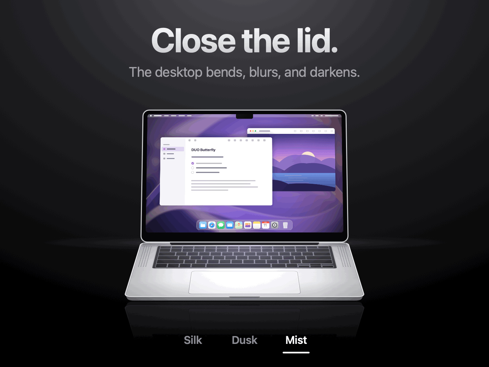

<p align="center">
  
</p>

<h1 align="center">DUO Butterfly</h1>

<p align="center"><b>Your desktop moves with your MacBook.</b></p>

<p align="center">
  A free and open-source macOS app that bends, blurs and dims your desktop in real time as you close the MacBook lid.
</p>

<p align="center">
  <a href="https://github.com/galaxysochi-code/DuoButterfly/releases/latest"><b>Download for free</b></a> ·
  <a href="https://duobutterfly.com/">Website</a> ·
  <a href="https://github.com/galaxysochi-code/DuoButterfly/releases/latest">Latest Release</a>
</p>

<p align="center">
  <a href="https://github.com/galaxysochi-code/DuoButterfly/actions/workflows/ci.yml"></a>
  <a href="https://github.com/galaxysochi-code/DuoButterfly/releases/latest"></a>
  
  
  
  <a href="LICENSE"></a>
</p>

<p align="center">
  
</p>

DUO Butterfly reads the real lid angle of a supported MacBook and uses it to drive a live Metal
desktop effect. Everything runs locally on your Mac — no account, analytics or network requests.

> **🪟 A Windows version is coming soon.** Star or watch the repository to get notified.

<p align="center">
  <b>English</b> · <a href="#简体中文">简体中文</a> · <a href="#español">Español</a> · <a href="#русский">Русский</a>
</p>

## Features

- **Follows the lid in real time.** The lower the lid, the stronger the effect — no pre-recorded animation.
- **Three styles:** Silk (soft bend), Dusk (deep shadows) and Mist (frosted glass).
- **Fine control** over bend, blur, darkness and the lid angle at which the effect turns off.
- **Live preview** with a lid-angle slider, plus a five-second demo on the desktop.
- **Menu bar app** with an ON/OFF switch and the **⌘⌥B** shortcut.
- **Clear guidance** when the effect can't run, such as missing screen access or an unavailable sensor.
- Optional sound when the lid opens, and launch at login.
- **Four languages:** English, Simplified Chinese, Spanish and Russian.
- One-click diagnostics report for bug reports.

<p align="center">
  
</p>

## Requirements

- macOS 26 or later.
- An Apple silicon MacBook **with a lid-angle sensor**. MacBook Air M1 and 13-inch
  MacBook Pro M1/M2 don't have one. See the [compatibility table](docs/COMPATIBILITY.md).
- Screen Recording permission, used only to draw the effect on the built-in display.

## Installation

1. Download `DuoButterfly-…-macos-arm64-adhoc.zip` from the
   [latest release](https://github.com/galaxysochi-code/DuoButterfly/releases/latest).
2. Unzip it and move **DUO Butterfly** to Applications.
3. The app isn't notarized by Apple, so macOS blocks the first launch. Open
   **System Settings → Privacy & Security** and click **Open Anyway**.
4. In the app, click **Allow Access…** and turn on DUO Butterfly in Screen Recording settings.
   DUO Butterfly needs this permission only to create the visual effect on the built-in
   display — it does not record video or audio. Restart the app if macOS asks.
5. Lower the lid or click **Show**.

Updating, uninstalling and troubleshooting: [docs/INSTALLING.md](docs/INSTALLING.md).

## Privacy

Screen frames are processed locally in memory with Metal and are never saved, uploaded or sent
anywhere. No audio is recorded. Capture stops when the effect isn't needed. The app makes no
network requests. See [PRIVACY.md](PRIVACY.md).

## Build from source

```bash
brew install xcodegen
git clone https://github.com/galaxysochi-code/DuoButterfly.git
cd DuoButterfly
./scripts/test.sh unit
./build.sh adhoc
```

The archive appears in `dist/`. More options: [docs/BUILDING.md](docs/BUILDING.md).

## Contributing

Report bugs and ideas in [Issues](https://github.com/galaxysochi-code/DuoButterfly/issues).
Read [CONTRIBUTING.md](CONTRIBUTING.md) before opening a pull request.
Report vulnerabilities privately — see [SECURITY.md](SECURITY.md).

If you enjoy the app, use the **Say Thanks** button inside it.

## License

[MIT](LICENSE). Logo and assets: [ASSETS.md](ASSETS.md). Third-party licenses:
[THIRD_PARTY_NOTICES.txt](THIRD_PARTY_NOTICES.txt). Not affiliated with Apple.

---

## 简体中文

**桌面随 MacBook 一起动起来。**

DUO Butterfly 是一款免费开源的 macOS 菜单栏应用。它读取 MacBook 屏幕盖的实际角度，
在你合上屏幕盖时让桌面实时弯曲、模糊并变暗；再次打开，一切平滑恢复。所有处理都在你的 Mac 上完成：
无需账户，没有数据分析，也不发送任何网络请求。

[免费下载](https://github.com/galaxysochi-code/DuoButterfly/releases/latest) · [网站](https://duobutterfly.com/)

> **🪟 Windows 版本即将推出。** 点按 Star 或 Watch 关注本仓库，即可第一时间获得通知。

<p align="center">
  
</p>

### 功能

- **随屏幕盖实时变化：** 合得越低，效果越强，不是预录动画。
- **三种风格：** 丝绸（柔和弯曲）、暮色（深邃阴影）、薄雾（磨砂玻璃）。
- 可调节弯曲、模糊、变暗程度，以及效果关闭的屏幕盖角度。
- 带屏幕盖角度滑块的实时预览，以及在桌面上的五秒演示。
- 菜单栏中的开/关开关和 **⌘⌥B** 快捷键。
- 当效果无法运行时（例如没有屏幕访问权限或传感器不可用），应用会提示下一步操作。
- 可选的开盖提示音，以及登录时自动启动。
- **四种界面语言：** 英语、简体中文、西班牙语、俄语。
- 一键复制诊断报告，便于反馈问题。

### 系统要求

- macOS 26 或更高版本。
- 配备 Apple 芯片**且带有屏幕盖角度传感器**的 MacBook。MacBook Air M1 和 13 英寸
  MacBook Pro M1/M2 没有该传感器，详见[兼容性表格](docs/COMPATIBILITY.md)。
- 屏幕录制权限，仅用于在内置显示屏上生成效果。

### 安装

1. 从[最新版本](https://github.com/galaxysochi-code/DuoButterfly/releases/latest)下载
   `DuoButterfly-…-macos-arm64-adhoc.zip`。
2. 解压后将 **DUO Butterfly** 拖到“应用程序”文件夹。
3. 该应用未经 Apple 公证，首次打开时 macOS 会阻止运行。请打开
   **系统设置 → 隐私与安全性**，点按 **“仍要打开”**。
4. 在应用中点按 **“允许访问…”**，并在屏幕录制设置中开启 DUO Butterfly。
   该权限仅用于在内置显示屏上生成视觉效果，不会录制视频或声音。如果 macOS 要求，请重新启动应用。
5. 合上一些屏幕盖，或点按 **“展示”**。

更多说明和常见问题：[docs/INSTALLING.md](docs/INSTALLING.md)。

### 隐私

屏幕画面仅在本机内存中通过 Metal 处理，不会被保存、上传或发送。不会录制声音。
不需要效果时会停止捕获。应用不发送任何网络请求。详见 [PRIVACY.md](PRIVACY.md)。

### 许可证

[MIT](LICENSE)。与 Apple 无关。

---

## Español

**Tu escritorio se mueve con tu MacBook.**

DUO Butterfly es una app gratuita y de código abierto para la barra de menús de macOS. Lee el
ángulo real de la tapa del MacBook y, al cerrarla, curva, desenfoca y oscurece el escritorio en
tiempo real; al abrirla, todo vuelve suavemente a su sitio. Todo ocurre en tu Mac: sin cuenta,
sin analíticas y sin conexiones de red.

[Descargar gratis](https://github.com/galaxysochi-code/DuoButterfly/releases/latest) · [Sitio web](https://duobutterfly.com/)

> **🪟 Muy pronto habrá una versión para Windows.** Marca el repositorio con Star o Watch para enterarte.

<p align="center">
  
</p>

### Funciones

- **Sigue la tapa en tiempo real:** cuanto más bajas la tapa, más intenso es el efecto. No es una animación pregrabada.
- **Tres estilos:** Seda (curva suave), Crepúsculo (sombras profundas) y Niebla (cristal esmerilado).
- Ajuste de la curva, el desenfoque, la oscuridad y el ángulo de la tapa en el que se desactiva el efecto.
- Vista previa en vivo con un control del ángulo de la tapa y una demostración de cinco segundos.
- Interruptor SÍ/NO en la barra de menús y el atajo **⌘⌥B**.
- Indicaciones cuando el efecto no puede funcionar, por ejemplo sin acceso a la pantalla
  o con el sensor no disponible.
- Sonido opcional al abrir la tapa e inicio automático al iniciar sesión.
- **Cuatro idiomas:** inglés, chino simplificado, español y ruso.
- Informe de diagnóstico que se copia con un clic.

### Requisitos

- macOS 26 o posterior.
- Un MacBook con Apple silicon **y sensor de ángulo de la tapa**. El MacBook Air M1 y el
  MacBook Pro de 13 pulgadas M1/M2 no lo tienen. Consulta la [tabla de compatibilidad](docs/COMPATIBILITY.md).
- Permiso de grabación de pantalla, solo para dibujar el efecto en la pantalla integrada.

### Instalación

1. Descarga `DuoButterfly-…-macos-arm64-adhoc.zip` desde la
   [última versión](https://github.com/galaxysochi-code/DuoButterfly/releases/latest).
2. Descomprímelo y mueve **DUO Butterfly** a Aplicaciones.
3. Apple no ha notarizado la app, así que macOS bloquea la primera apertura. Abre
   **Ajustes del Sistema → Privacidad y seguridad** y haz clic en **Abrir igualmente**.
4. En la app, haz clic en **Permitir acceso…** y activa DUO Butterfly en Grabación de pantalla.
   Este permiso solo se usa para crear el efecto visual en la pantalla integrada; no graba vídeo
   ni audio. Reinicia la app si macOS lo pide.
5. Baja la tapa o haz clic en **Mostrar**.

Más detalles y solución de problemas: [docs/INSTALLING.md](docs/INSTALLING.md).

### Privacidad

Los fotogramas se procesan localmente, en memoria, con Metal, y nunca se guardan, se suben ni se
envían. No se graba audio. La captura se detiene cuando el efecto no es necesario. La app no se
conecta a internet. Consulta [PRIVACY.md](PRIVACY.md).

### Licencia

[MIT](LICENSE). Sin relación con Apple.

---

## Русский

**Рабочий стол движется вместе с MacBook.**

DUO Butterfly — бесплатное приложение для macOS с открытым кодом. Оно считывает реальный угол
крышки MacBook: когда вы её закрываете, рабочий стол в реальном времени изгибается, размывается
и темнеет, а при открытии плавно возвращается. Всё работает локально на вашем Mac: без аккаунта,
аналитики и сетевых запросов.

[Скачать бесплатно](https://github.com/galaxysochi-code/DuoButterfly/releases/latest) · [Сайт](https://duobutterfly.com/)

> **🪟 Скоро выйдет версия для Windows.** Нажмите Star или Watch у репозитория, чтобы не пропустить.

<p align="center">
  
</p>

### Возможности

- **Следует за крышкой в реальном времени:** чем ниже крышка, тем сильнее эффект. Это не записанная заранее анимация.
- **Три стиля:** Шёлк (мягкий изгиб), Сумерки (глубокие тени) и Туман (матовое стекло).
- Настройка изгиба, размытия, затемнения и угла крышки, при котором эффект отключается.
- Живой предпросмотр с ползунком угла крышки и пятисекундная демонстрация на рабочем столе.
- Переключатель ВКЛ/ВЫКЛ в строке меню и сочетание клавиш **⌘⌥B**.
- Подсказки, если эффект не может работать: нет доступа к экрану или недоступен датчик.
- Звук при открытии крышки и запуск при входе в систему — по желанию.
- **Четыре языка:** английский, китайский, испанский и русский.
- Отчёт диагностики копируется одной кнопкой.

### Требования

- macOS 26 или новее.
- MacBook с Apple silicon **и датчиком угла крышки**. У MacBook Air M1 и MacBook Pro 13″
  с M1/M2 такого датчика нет. Подробнее — в [таблице совместимости](docs/COMPATIBILITY.md).
- Разрешение на запись экрана — только чтобы рисовать эффект на встроенном дисплее.

### Установка

1. Скачайте `DuoButterfly-…-macos-arm64-adhoc.zip` из
   [последнего выпуска](https://github.com/galaxysochi-code/DuoButterfly/releases/latest).
2. Распакуйте архив и перенесите **DUO Butterfly** в «Программы».
3. Приложение не нотаризовано Apple, поэтому macOS заблокирует первый запуск. Откройте
   **Системные настройки → Конфиденциальность и безопасность** и нажмите **«Все равно открыть»**.
4. В приложении нажмите **«Разрешить доступ…»** и включите DUO Butterfly в настройках записи
   экрана. Разрешение нужно только для визуального эффекта на встроенном дисплее: приложение не
   записывает ни видео, ни звук. Перезапустите приложение, если macOS попросит.
5. Прикройте крышку или нажмите **«Показать»**.

Подробности и решение проблем — в [docs/INSTALLING.md](docs/INSTALLING.md).

### Конфиденциальность

Кадры экрана обрабатываются локально, в памяти, с помощью Metal. Они не сохраняются, не загружаются
и никуда не отправляются. Звук не записывается. Когда эффект не нужен, захват останавливается.
Сетевых запросов у приложения нет. Подробнее — в [PRIVACY.md](PRIVACY.md).

### Лицензия

[MIT](LICENSE). Проект не связан с Apple.
